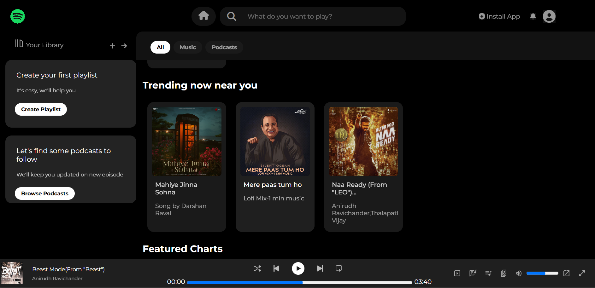

# Spotify Web Player Clone

My first coding project — a static clone of the Spotify web player UI, built using only **HTML and CSS**.



## About

This was my starting point for learning web development. The goal was simple: take a real, complex, well-known UI (Spotify's web player) and try to rebuild it pixel-by-pixel using just HTML and CSS — no frameworks, no JavaScript.

## Features

- **Top navbar** — Spotify logo, home icon, search bar, install app button, notifications bell, and profile icon
- **Sidebar** — "Your Library" section with "Create your first playlist" and "Let's find some podcasts to follow" prompt cards
- **Sticky category tabs** — All / Music / Podcasts
- **Content sections** — Recently Played, Trending Now Near You, and Featured Charts, each rendered as a scrollable row of cards
- **Bottom music player bar** — album art, track title & artist, playback controls, progress bar, and volume slider
- **Custom scrollbar** styling to match Spotify's dark theme

> **Note:** This is a UI clone only. Elements like the search bar, playback buttons, progress bar, and volume slider are styled to look and feel real, but aren't functional yet — no JavaScript has been added.

## Tech Stack

- HTML5
- CSS3 (Flexbox, fixed/absolute positioning)
- [Font Awesome](https://fontawesome.com/) (via CDN) for icons
- [Google Fonts](https://fonts.google.com/) — Montserrat

## What I Learned

- Structuring a multi-section layout with semantic HTML
- Using Flexbox to build nav bars, sidebars, and card grids
- Combining `fixed` and `absolute` positioning to pin the navbar and player bar while scrolling content independently
- Pulling in and using external resources (icon libraries, custom fonts) via CDN
- Styling scrollbars and hover states for a more polished, app-like feel

## How to Run

No build steps or dependencies — just clone the repo and open `index.html` in your browser.

```bash
git clone <your-repo-url>
cd spotify-clone
open index.html
```

## What's Next

- Add JavaScript to make the search bar, play/pause button, and progress/volume sliders actually work
- Make the layout responsive for smaller screens
- Hook up real audio playback

---

Built as my first project while learning to code 🎧
